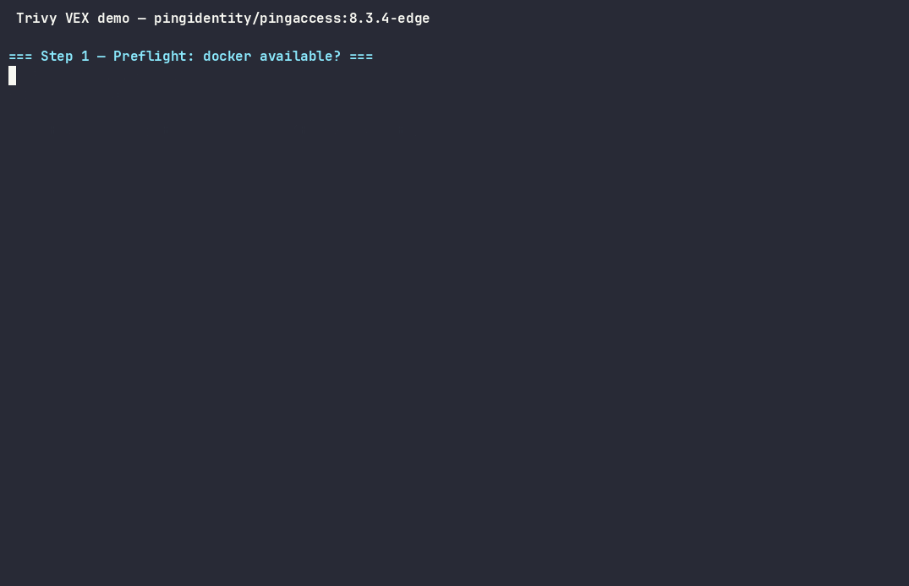

# Trivy VEX demo — CVE suppression for `pingidentity/pingaccess:8.3.4-edge`

A working VEX-based CVE-suppression workflow following Docker's
["Hardened Images Are Free. Now What?"](https://www.docker.com/blog/hardened-images-free-now-what/)
pattern: scan → assess → publish OpenVEX → suppress on re-scan. VEX statements
are distributed through **three independent channels**:

1. **Docker Scout attestations** (`docker scout attestation add`) — Scout
   reads these from the registry; primary mechanism for Scout consumers.
2. **Trivy VEX repository** (vex-repo-spec v0.1) — consumed by Trivy via
   `--vex repo`; also usable with `--vex <file>`.
3. **Wiz artifacts** — see [wiz-integration.md](wiz-integration.md).

Channels 1 and 2 are generated from the **same OpenVEX statements** but use
different product PURLs (`pkg:docker/` for Scout, `pkg:oci/` for Trivy/Wiz)
and different packaging. They are kept completely separate; updating one does
not update the other.

> **DEMO ONLY.** Every statement here is `not_affected /
> vulnerable_code_not_in_execute_path` generated mechanically for all 51
> findings. That is a suppression-workflow POC, **not** a real exploitability
> analysis — the `status_notes` of every statement says so.

Versions (verified at build time, 2026-06-13): Trivy **v0.71.0**, vexctl
**v0.4.1**, OpenVEX **v0.2.0**, vex-repo-spec **v0.1**, Docker Scout **latest
via install.sh** (verify at <https://docs.docker.com/scout/install/>).

## Demo



Recorded with asciinema in WSL and rendered to GIF with
[agg](https://github.com/asciinema/agg) (from this directory):

```sh
# record the unattended run (-i 2 caps idle gaps at 2s)
COLUMNS=110 LINES=30 asciinema rec -q --overwrite -i 2 -c "./run.sh -y" demo.cast

# render to GIF — note the /data/ prefixes: the agg image's workdir
# is not /data, so relative filenames fail with "No such file or directory"
docker run --rm -u $(id -u):$(id -g) -v "$PWD:/data" \
  ghcr.io/asciinema/agg /data/demo.cast /data/demo.gif
```

## Results

|                                | baseline        | `--vex <file>` | `--vex repo` |
| ------------------------------ | --------------- | -------------- | ------------ |
| CRITICAL / HIGH / MEDIUM / LOW | 2 / 18 / 42 / 8 | 0              | 0            |
| findings reported              | **70**          | **0**          | **0**        |
| suppressed (`not_affected`)    | –               | 70             | 70           |

Full numbers in [comparison.txt](comparison.txt). Suppressed findings appear in
`suppressed-report.json` under `Results[].ExperimentalModifiedFindings`
(`Type: ignored`, `Statement: vulnerable_code_not_in_execute_path`) and in scan
output when `--show-suppressed` is passed.

### Which mechanisms actually drive suppression

| mechanism                  | original image (digest-pinned) | derived image with embedded VEX |
| -------------------------- | ------------------------------ | ------------------------------- |
| a) `--vex <local file>`    | 70/70 suppressed               | 0 suppressed                    |
| b) `--vex repo`            | 70/70 suppressed               | 0 suppressed                    |
| c) embedded VEX file alone | n/a                            | 0 suppressed                    |

Two findings worth knowing:

1. **Trivy does NOT auto-discover VEX embedded in the image filesystem.**
   Copying the document into the image (Phase 5, `embed/Dockerfile`) is purely
   a *distribution* convenience — a consumer must extract it and pass it via
   `--vex`. (Trivy *can* auto-discover VEX attached as a signed **OCI registry
   attestation** — `trivy image --vex oci` — but that requires pushing, which
   this demo deliberately does not do.)
2. **VEX products bind to the image digest.** The statements identify the
   product as `pkg:oci/pingaccess@sha256:51689e8c…` (digest, not tag — as a
   VEX product should). A locally built derived image has *no* repo digest
   until pushed, so nothing can match it. In real life: attach/publish VEX for
   the digest of the image you actually ship, and regenerate when it changes.
3. **(Repo gotcha)** For `pkg:oci` purls, Trivy's repository index lookup keeps
   the `repository_url` qualifier. The index `id` must therefore be
   `pkg:oci/pingaccess?repository_url=index.docker.io%2Fpingidentity%2Fpingaccess`
   — a bare `pkg:oci/pingaccess` is never matched (verified empirically; see
   `pkg/vex/repo.go` in trivy v0.71.0).

## File layout

```text
trivy-vex-demo/
├── toolchain/Dockerfile              # vex-toolchain: alpine + trivy + vexctl + docker-cli + Scout
├── embed/Dockerfile                  # Phase 5d fallback: derived image with embedded VEX docs
├── scripts/generate-vex.sh           # per-CVE vexctl create for both pkg:oci + pkg:docker PURLs
├── baseline-report.json / baseline-summary.txt      # Phase 2 scan (70 findings / 51 IDs)
├── suppressed-report.json / suppressed-summary.txt  # Trivy --vex file: 0 findings, 70 suppressed
├── rescan-original-repo.json         # Trivy --vex repo: 0 findings, 70 suppressed
├── scout-suppressed-report.txt       # docker scout cves after attestation (Step 11)
├── rescan-{a-local-vex,b-repo,c-embedded-only}.json # derived-image scans (no suppression)
├── comparison.txt                    # before/after diff
├── wiz-integration.md                # how to feed these artifacts to Wiz
├── vex/
│   ├── statements/<CVE-ID>.openvex.json     # pkg:oci per-CVE docs (Trivy/Wiz channel)
│   ├── pingaccess-8.3.4-edge.openvex.json   # merged pkg:oci consolidated doc
│   ├── statements-scout/<CVE-ID>.vex.json   # pkg:docker per-CVE docs (Scout channel)
│   └── pingaccess-scout.vex.json            # merged pkg:docker consolidated doc
├── vex-repo-src/                     # CLEAN Trivy repo layout
│   ├── index.json                    # purl → vex.json mapping (repository_url qualifier required)
│   └── pkg/oci/pingaccess/vex.json
├── vex-repo/                         # SERVED webroot (nginx)
│   ├── .well-known/vex-repository.json    # spec v0.1 manifest
│   └── v0.1/vex-data.tar.gz               # archive of vex-repo-src
└── trivy-config/repository.yaml      # mounted to /root/.trivy/vex/repository.yaml
```

## Three distribution channels

The same OpenVEX statements are published through three independent channels.
Updating one does **not** update the others — each must be republished
separately when statements change.

### 1. Docker Scout attestations (primary for Scout consumers)

Statements use the `pkg:docker/pingidentity/pingaccess@8.3.4-edge` PURL.
Each `.vex.json` in `vex/statements-scout/` is attached to the image in a
registry as an in-toto attestation via `docker scout attestation add`. Scout
reads them directly from the registry; no manual extraction needed.

**Attestation-vs-filesystem precedence rule:** if an image has **any**
attestation (including provenance auto-added by BuildKit), Scout ignores all
filesystem-embedded VEX entirely and reads only attestations. This means:

- If you push with `--provenance=true` (the default in modern BuildKit), the
  filesystem `COPY` approach is silently bypassed.
- To use the filesystem path (Phase 5d), build with
  `docker build --provenance=false --sbom=false`.
- When attestations are available, always prefer them — they travel with the
  image in the registry and are consumable without image extraction.

### 2. Trivy VEX repository (primary for Trivy / Wiz consumers)

Statements use the `pkg:oci/pingaccess@sha256:…` PURL (digest-pinned). The
merged consolidated document lives in `vex-repo-src/pkg/oci/pingaccess/vex.json`
and is served by nginx from the `.well-known/` manifest. Trivy fetches it via
`--vex repo`.

### 3. Wiz artifacts

See [wiz-integration.md](wiz-integration.md). Uses the same `pkg:oci` docs as
the Trivy channel.

## Hosting / update process

The repo is two parts: a **manifest** at
`https://<host>/.well-known/vex-repository.json` and a **tar.gz archive** of
`vex-repo-src/` (`index.json` + `pkg/` at archive root) at the URL named in
the manifest's `versions[].locations[].url`. The spec mandates HTTPS in
production; this demo serves plain HTTP on a private docker network.

To update statements:

1. Edit/regenerate documents in `vex/` (re-run `scripts/generate-vex.sh`).
2. Copy the consolidated doc to `vex-repo-src/pkg/oci/pingaccess/vex.json`,
   bump `updated_at` in `vex-repo-src/index.json`.
3. Re-archive: `tar -czf vex-repo/v0.1/vex-data.tar.gz index.json pkg`
   (run from `vex-repo-src/`).
4. Consumers re-fetch on the manifest's `update_interval` (1h here);
   `trivy vex repo download` forces it (or `trivy clean --vex-repo` first to
   refetch from scratch).

For Git hosting: push `vex-repo-src/` and publish the archive via releases or
CI to any static host; only the manifest URL is fixed (`/.well-known/…`).

## Reproduction

All commands from this directory; PowerShell-quoted paths shown as `$PWD`.

```sh
# 0. toolchain (now includes Docker CLI + Scout plugin)
docker build -t vex-toolchain:latest toolchain/

# 1. baseline (Phase 2)
docker pull pingidentity/pingaccess:8.3.4-edge
docker run --rm -v /var/run/docker.sock:/var/run/docker.sock \
  -v trivy-cache:/root/.cache/trivy -v "$PWD:/work" vex-toolchain:latest \
  trivy image --format json --output /work/baseline-report.json \
  pingidentity/pingaccess:8.3.4-edge

# 2. generate VEX (Phase 3) — pkg:oci (Trivy/Wiz) + pkg:docker (Scout)
docker run --rm -v "$PWD:/work" vex-toolchain:latest \
  sh -c "tr -d '\r' < /work/scripts/generate-vex.sh > /tmp/g.sh && sh /tmp/g.sh"

# 3. VEX repository (Phase 4 — Trivy channel)
mkdir -p vex-repo-src/pkg/oci/pingaccess vex-repo/v0.1
cp vex/pingaccess-8.3.4-edge.openvex.json vex-repo-src/pkg/oci/pingaccess/vex.json
docker run --rm -v "$PWD:/work" vex-toolchain:latest \
  sh -c "cd /work/vex-repo-src && tar -czf /work/vex-repo/v0.1/vex-data.tar.gz index.json pkg"
docker network create vexnet
docker run -d --name vex-server --network vexnet \
  -v "$PWD/vex-repo:/usr/share/nginx/html:ro" nginx:alpine
docker run --rm --network vexnet -v trivy-cache:/root/.cache/trivy \
  -v "$PWD/trivy-config:/root/.trivy/vex" vex-toolchain:latest \
  sh -c "trivy vex repo list && trivy vex repo download"

# 4. Scout Phase 5a — dry-run (requires docker scout on host)
docker scout cves pingidentity/pingaccess:8.3.4-edge --vex-location "$PWD/vex"
# CHECKPOINT: confirm not_affected CVEs are absent. If auth needed: docker login

# 5. Scout Phase 5b — local registry + push + attestations
docker run -d -p 5000:5000 --name vex-registry registry:2
docker tag pingidentity/pingaccess:8.3.4-edge localhost:5000/pingidentity/pingaccess:8.3.4-edge
docker push localhost:5000/pingidentity/pingaccess:8.3.4-edge
for f in vex/statements-scout/*.vex.json; do
  docker scout attestation add \
    --file "$f" \
    --predicate-type https://openvex.dev/ns/v0.2.0 \
    localhost:5000/pingidentity/pingaccess:8.3.4-edge
done

# 6. Scout Phase 5c — re-scan to prove suppression
docker scout cves localhost:5000/pingidentity/pingaccess:8.3.4-edge \
  | tee scout-suppressed-report.txt

# 7. Trivy suppression scans (Phase 5 Trivy channel)
#    a) local file vs digest-pinned original — 0 findings / 70 suppressed
docker run --rm -v /var/run/docker.sock:/var/run/docker.sock \
  -v trivy-cache:/root/.cache/trivy -v "$PWD:/work" vex-toolchain:latest \
  trivy image --skip-db-update --format json --show-suppressed \
  --vex /work/vex/pingaccess-8.3.4-edge.openvex.json \
  --output /work/suppressed-report.json pingidentity/pingaccess:8.3.4-edge
#    b) repository vs digest-pinned original — 0 findings / 70 suppressed
docker run --rm --network vexnet -v /var/run/docker.sock:/var/run/docker.sock \
  -v trivy-cache:/root/.cache/trivy -v "$PWD/trivy-config:/root/.trivy/vex" \
  -v "$PWD:/work" vex-toolchain:latest \
  trivy image --skip-db-update --format json --show-suppressed --vex repo \
  --output /work/rescan-original-repo.json pingidentity/pingaccess:8.3.4-edge

# 8. Phase 5d fallback — embedded-VEX image (filesystem embed, Scout-ignored if attestations present)
#    Build with provenance/sbom disabled to keep filesystem VEX active for Scout:
#    docker build --provenance=false --sbom=false -f embed/Dockerfile -t pingaccess-vex:8.3.4-edge-demo .
docker build -f embed/Dockerfile -t pingaccess-vex:8.3.4-edge-demo .

# teardown
docker rm -f vex-server vex-registry && docker network rm vexnet
```

Nothing is pushed to public registries; the only external traffic is Docker Hub
pulls, Trivy DB downloads, and local nginx/registry:2 on `vexnet` / port 5000.
